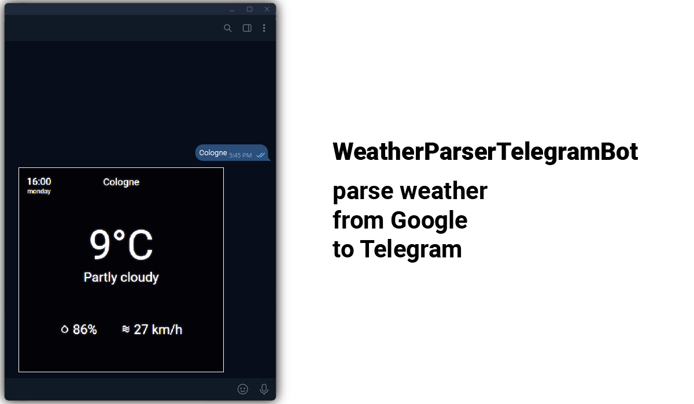

## About

- The bot makes a request to Google like: `%entered city% weather`
- Inserts weather data into an HTML form
- Takes a screenshot of the HTML form and sends it to telegram

## Usage
- Install dependencies
- Create a .env file in the root of the directory
- Write in the file:
```
TOKEN = ' %token of your telegram bot% '
```
- Run bot.py and enjoy!

## Developers

- [vierhundertundvierzigahcaptain](https://github.com/vierhundertundvierzigahcaptain)
